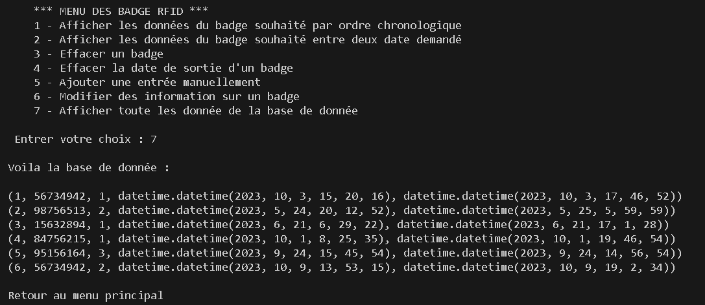

# Projet de gestion de badges RFID

Le projet permet de gérer les données des badges RFID via une interface en ligne de commande. \
Le programme Python fonctionne sous la forme d'une boucle infinie qui affiche une mini-interface dans le terminal de l'éditeur.

## Sommaire
- [Aperçu](#aperçu)
- [Fonctionnalités](#fonctionnalités)
- [Utilisation](#utilisation)
- [Configuration de la Base de Données](#configuration-de-la-base-de-données)
- [Technologies Utilisées](#technologies-utilisées)
- [Licence](#licence)

## Aperçu
La base de données :
\


Exemples d'utilisation du programme :
\



## Fonctionnalités

- **Affichage des données** : affiche les données des badges RFID enregistrés, avec options de tri et de filtrage.
- **Modification des données** : met à jour les informations associées aux badges.
- **Suppression des données** : supprime les informations d'un badge spécifique.

## Utilisation

Pour exécuter le projet, lancez le fichier `badge_RFID.py` dans un environnement Python.\
Assurez-vous que la base de données MySQL est configurée comme indiqué ci-dessous.

## Configuration de la Base de Données

Le projet utilise une base de données MySQL locale. Voici les étapes de configuration :

### Installation de MySQL

1. Téléchargez MySQL : [MySQL Community Downloads](https://dev.mysql.com/downloads/installer/)
2. Suivez les instructions d’installation pour votre système d’exploitation.
3. Choisissez la version "Serveur only".
4. Laissez toutes les configurations par défaut.
5. Il vous sera demandé de définir un mot de passe pour l'utilisateur `root` de MySQL. Gardez ce mot de passe, vous en aurez besoin pour vous connecter à MySQL depuis Python.

### Démarrer MySQL

1. Ouvrez `MySQL Command Line Client` depuis votre barre de recherche et entrez votre mot de passe. 

### Installation du connecteur MySQL pour Python

Le projet utilise le connecteur MySQL pour Python afin de communiquer avec la base de données MySQL. Suivez les étapes ci-dessous pour installer le connecteur :

1. Ouvrez un cmd ou terminal de commande (invité de commande).
2. Exécutez cette commande : 
```bash 
pip install mysql-connector-python
```

### Création de la Base de Données et des Tables

Une fois MySQL installé et le connecteur Python prêt, vous pouvez créer la base de données et la table pour stocker les données des badges RFID.

1. Ouvrez `MySQL Command Line Client` depuis votre barre de recherche et entrez votre mot de passe. 

2. Une fois connecté à MySQL, vous pouvez créer la base de données. Exécutez la commande suivante pour créer une base de données nommée `badge` :
```bash
CREATE DATABASE badge;
```

3. Sélectionnez la Base de Données pour pouvoir y ajouter la table de donnée :
```bash
USE badge;
```

4. Créer la Table `badge` qui contient les informations des badges RFID :
```bash
CREATE TABLE badge(id int(2) NOT NULL AUTO_INCREMENT, num_badge INTEGER ,num_porte_entree INTEGER, date_heure_entree datetime, date_heure_sortie datetime, PRIMARY KEY(id) );
```

5. Création des données : Exécutez les commandes SQL suivantes pour insérer des données dans la table :
```bash
INSERT INTO badge (num_badge, num_porte_entree, date_heure_entree, date_heure_sortie) VALUES("56734942",1,"2023-10-03 15:20:16","2023-10-03 17:46:52");
```
```bash
INSERT INTO badge (num_badge, num_porte_entree, date_heure_entree, date_heure_sortie) VALUES("98756513",2,"2023-05-24 20:12:52","2023-05-25 05:59:59");
```
```bash
INSERT INTO badge (num_badge, num_porte_entree, date_heure_entree, date_heure_sortie) VALUES("15632894",1,"2023-06-21 06:29:22","2023-06-21 17:01:28");
```
```bash
INSERT INTO badge (num_badge, num_porte_entree, date_heure_entree, date_heure_sortie) VALUES("84756215",1,"2023-10-01 08:25:35","2023-10-01 19:46:54");
```
```bash
INSERT INTO badge (num_badge, num_porte_entree, date_heure_entree, date_heure_sortie) VALUES("95156164",3,"2023-09-24 15:45:54","2023-09-24 14:56:54");
```
```bash
INSERT INTO badge (num_badge, num_porte_entree, date_heure_entree, date_heure_sortie) VALUES("56734942",2,"2023-10-09 13:53:15","2023-10-09 19:02:34");
```

6. Vérification de vos données (facultatif) : Exécutez la commande SQL suivante pour vérifier que vos données sont bien enregistrées.
```bash
SELECT * FROM badge;
```

### Configuration de la Connexion MySQL dans le Code Python

Maintenant que la base de données est créée, vous devez configurer la connexion MySQL dans votre code Python. Voici le code pour établir la connexion depuis le fichier Python `badge_RFID.py` (ligne 7 à 13) :
```python
import mysql.connector

conn = mysql.connector.connect(
    host="localhost",            # Hôte de la base de données 
    user="root",                 # Nom d'utilisateur MySQL
    password="",                 # Mot de passe MySQL (ajoutez ici votre mot de passe défini)
    database="badge"             # Nom de la base de données à utiliser
)
```

## Technologies Utilisées

- **Python** : pour la logique du programme.
- **MySQL** : pour la gestion de la base de données des badges.

## Licence

Réalisation dans le cadre d'un projet scolaire.
